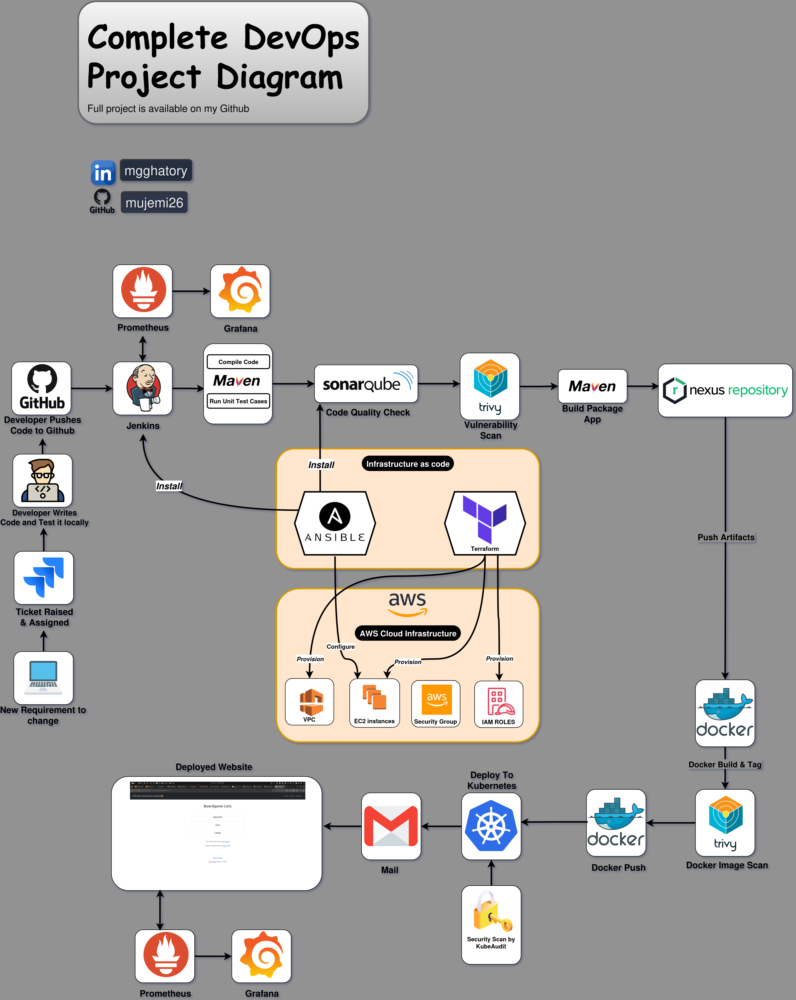
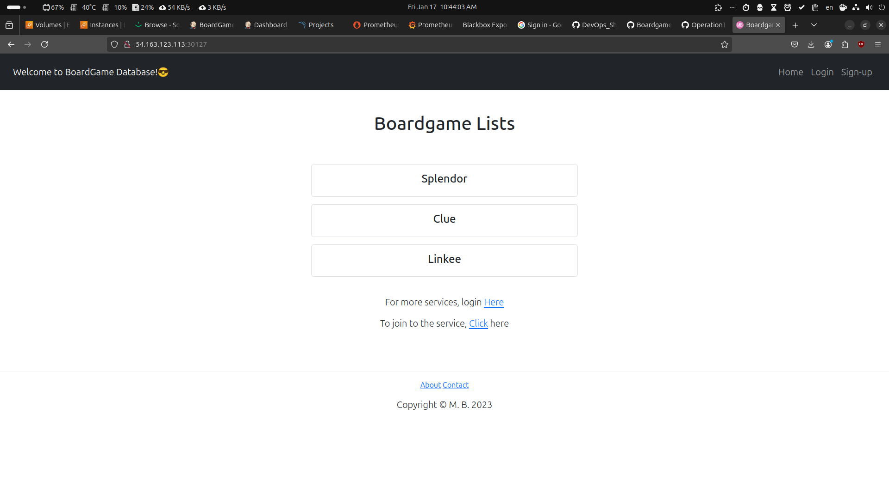
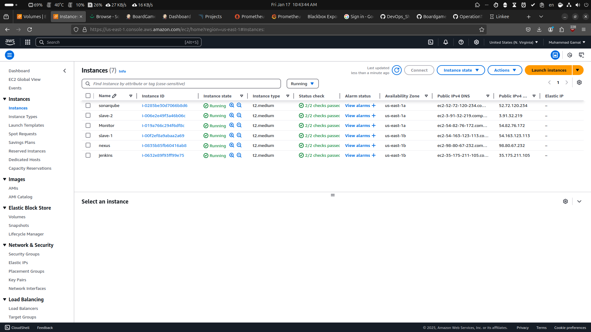
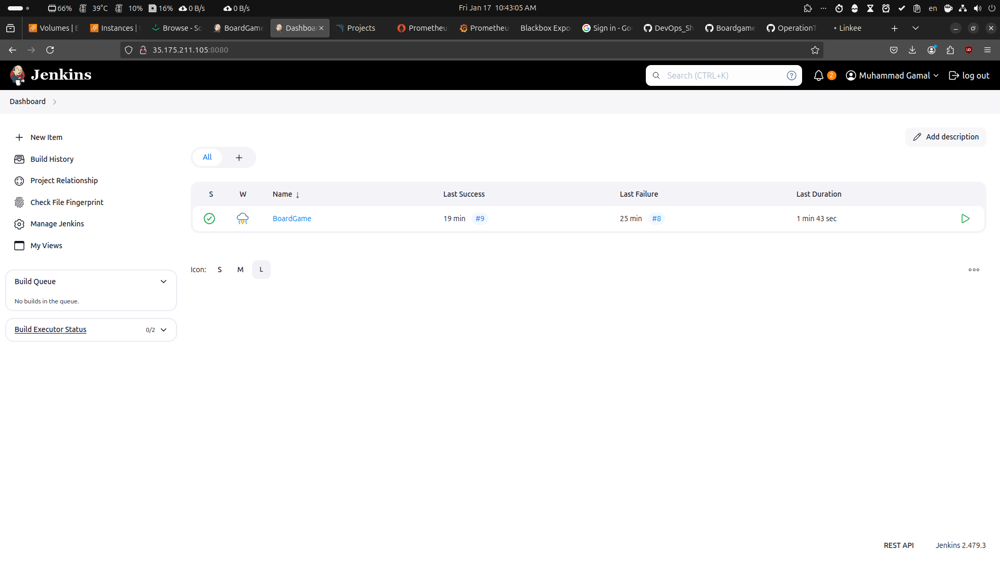
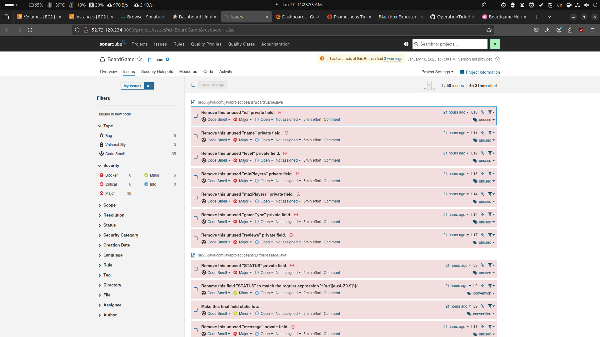
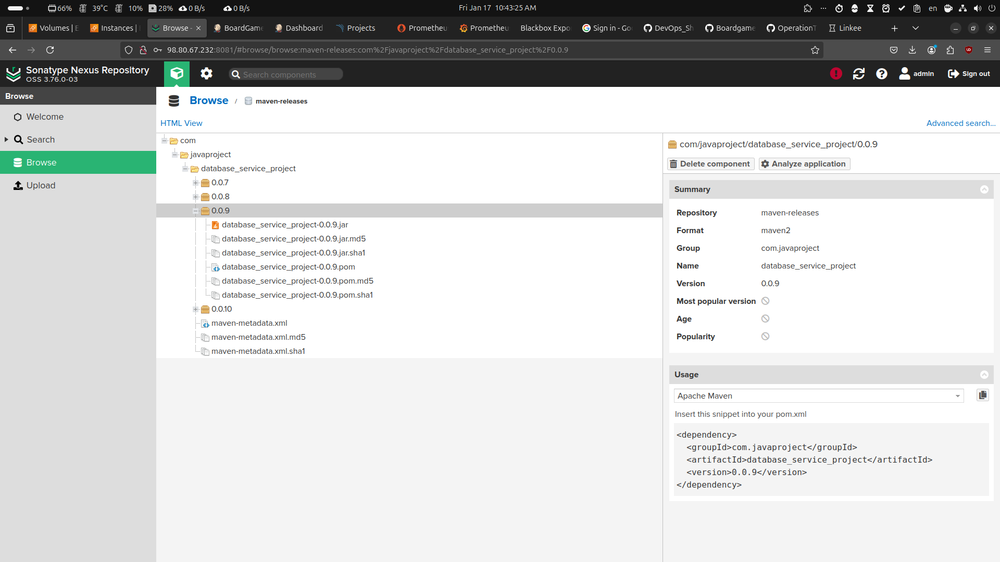
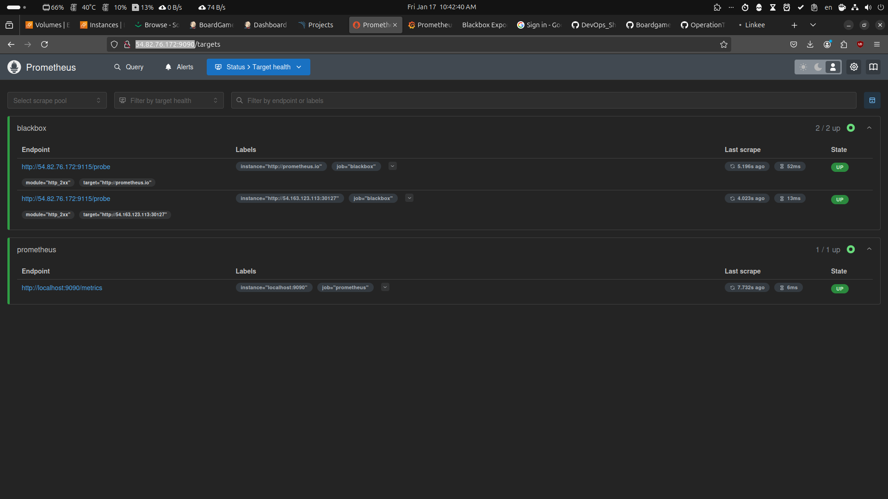
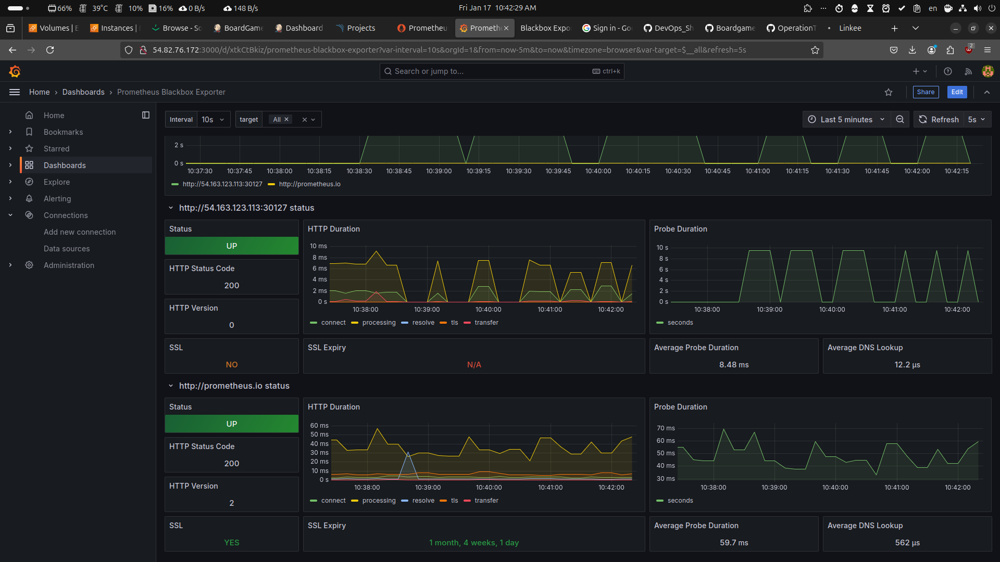
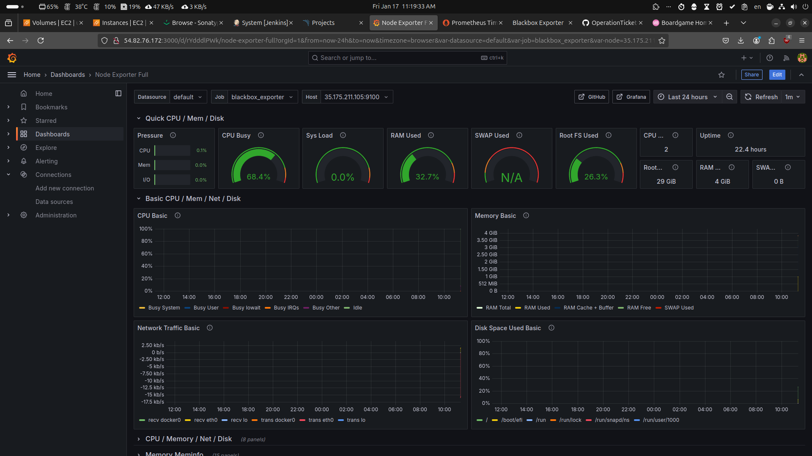

# 🎲 Board Game Review Platform

This web application displays lists of board games and their reviews. While anyone can view the board game lists and reviews, they are required to log in to add/ edit the board games and their reviews. The 'users' have the authority to add board games to the list and add reviews, and the 'managers' have the authority to edit/ delete the reviews on top of the authorities of users.

## 🎯 Features
- User authentication & role-based access control
- Browse game catalog and reviews
- CRUD operations for games and reviews
- Responsive web interface using Thymeleaf
- H2 database for data persistence

## Architecture Overview


## 🛠️ Tech Stack
- Java 11
- Spring Boot 2.5.6
- Spring Security
- Spring Data JPA
- Thymeleaf
- H2 Database
- Maven
- Terraform
- AWS
- Prometheus
- Grafana
- SonarQube
- Trivy
- Nexus Repository
- Ansible
- Docker
- Kubernetes
- Jenkins

## 📋 Prerequisites
- JDK 11
- Maven 3.x
- Docker 
- Kubernetes 

## 🚀 Quick Start

### Local Development
```bash
# Clone repository
git clone [https://github.com/mujemi26/BoardGame-review.git]

# Build project
mvn clean package

# Run application
java -jar target/*.jar
```

### Docker Deployment
```bash
# Build Docker image
docker build -t boardgame:latest .

# Run container
docker run -p 8080:8080 boardgame:latest
```

### Kubernetes Deployment
```bash
kubectl apply -f deployment-service.yaml
```

## How to Run

1. Clone the repository
2. Open the project in your IDE of choice
3. Run the application
4. To use initial user data, use the following credentials.
    - username: bugs    |     password: bunny (user role)
    - username: daffy   |     password: duck  (manager role)
5. You can also sign-up as a new user and customize your role to play with the application! 😊

## 🔒 Security Roles

| Role    | Permissions                               |
|---------|------------------------------------------|
| Guest   | View games and reviews                   |
| User    | Add games and create reviews             |
| Manager | Edit/delete reviews + all user privileges |

## 📦 Project Structure
```
boardgame/
├── src/
├── Dockerfile
├── Jenkinsfile
├── deployment-service.yaml
├── pom.xml
└── README.md
```

## 🔄 CI/CD Pipeline
- Automated build using Jenkins
- Stages: Compile → Test → Build
- Deployment to Kubernetes cluster

## 📝 API Documentation
Access the application at:
- Local: http://localhost:8080
- Production: [your-domain]

## Screenshots
 - Webapp
   
 - EC2 Instances
   
 - Jenkins Dashboard
   
 - SoanrQube
   
 - Nexus Repo
   
 - Prometheus
   
 - Grafana
   
   

## 🤝 Contributing
1. Fork the repository
2. Create feature branch
3. Commit changes
4. Push to branch
5. Create pull request
